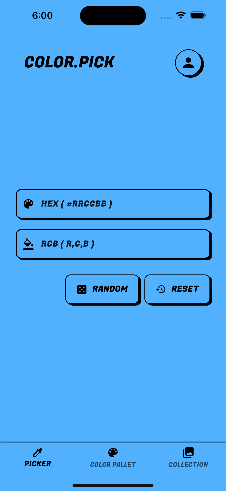
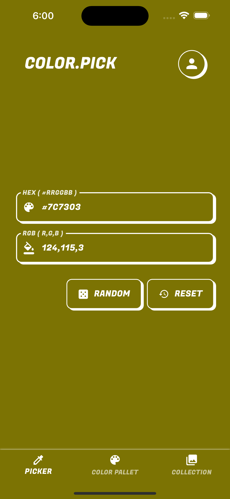
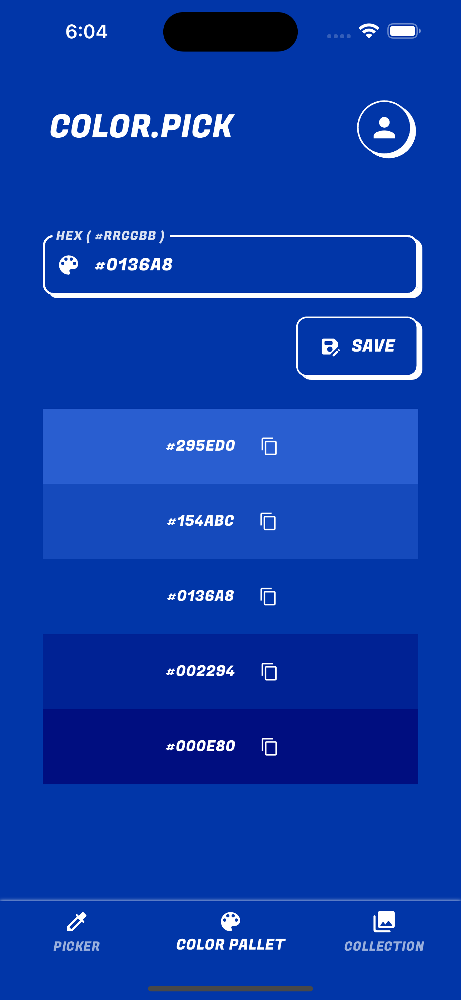
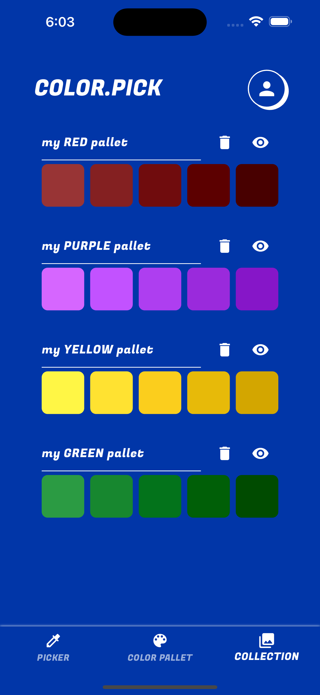

# 🎨 flutter-color-picker

> A **Flutter cross-platform application** for creating, saving, and managing color palettes — backed by **Firebase Firestore** with user authentication.

---

## 📋 Description

**flutter-color-picker** is a mobile (and desktop) application built with Flutter that lets users explore colors, build custom palettes, and save them to their personal account via Firebase.

Users can pick a color by entering a **HEX** or **RGB** value, generate it randomly, create a full palette from it, and save that palette to their Firebase collection. All data is tied to the authenticated user, making it a fully personalized experience.

**Key features:**
- 🎨 Pick colors via HEX code, RGB values, or random generation
- 🖌️ Generate a full color palette from any base color
- 💾 Save palettes to Firebase Firestore (per user)
- 📚 Browse and manage your saved palette collection
- ✏️ Rename palettes
- 🗑️ Delete palettes you no longer need
- 🔐 Firebase Authentication (email & password)

---

## 📱 Screenshots

### Home Screen — Color Picker
<p float="left">
  
  
</p>

> Pick a color by entering a **HEX** or **RGB** value, or generate one randomly with the "random" button.

---

### Palette Creation Screen


> Generate a full palette from your chosen color. Save it to your personal collection with one tap.

---

### Collection Screen


> Browse all your saved palettes, rename them, or delete the ones you no longer need.

---

## 🗂️ Project Structure

```
flutter-color-picker/
├── lib/                    # Dart source code (screens, widgets, services, models)
├── assets/
│   └── img/                # App screenshots and image assets
├── android/                # Android-specific configuration
├── ios/                    # iOS-specific configuration
├── linux/                  # Linux desktop target
├── macos/                  # macOS desktop target
├── windows/                # Windows desktop target
├── web/                    # Web target
├── test/                   # Widget and unit tests
├── pubspec.yaml            # Flutter dependencies and assets declaration
├── firebase.json           # Firebase hosting/emulator configuration
└── analysis_options.yaml   # Dart static analysis rules
```

---

## 🛠️ Tech Stack

| Layer | Technology |
|-------|-----------|
| Framework | Flutter |
| Language | Dart |
| Backend / Database | Firebase Firestore |
| Authentication | Firebase Auth (email & password) |
| State Management | Flutter built-in / Provider |
| Platforms | Android, iOS, Web, Linux, macOS, Windows |

---

## 🚀 Getting Started

### Prerequisites

Make sure you have the following installed:

- [Flutter SDK](https://docs.flutter.dev/get-started/install) (stable channel)
- [Dart SDK](https://dart.dev/get-dart) (bundled with Flutter)
- [Android Studio](https://developer.android.com/studio) or [VS Code](https://code.visualstudio.com/) with the Flutter extension
- [Firebase CLI](https://firebase.google.com/docs/cli) (for local emulation)
- A Firebase project configured for your app

---

### 1. Clone the repository

```bash
git clone https://github.com/yannisduvignau/flutter-color-picker.git
cd flutter-color-picker
```

### 2. Install dependencies

```bash
flutter pub get
```

### 3. Configure Firebase

1. Go to the [Firebase Console](https://console.firebase.google.com/)
2. Create a new Firebase project (or use an existing one)
3. Register your app (Android and/or iOS)
4. Download and add the configuration files:
   - **Android:** place `google-services.json` in `android/app/`
   - **iOS:** place `GoogleService-Info.plist` in `ios/Runner/`
5. Enable **Firestore Database** in the Firebase console
6. Enable **Authentication** → sign-in method → **Email/Password**

### 4. Run the app

```bash
# On a connected device or emulator
flutter run

# Specify a target platform
flutter run -d android
flutter run -d ios
flutter run -d chrome        # Web
flutter run -d linux
flutter run -d macos
flutter run -d windows
```

---

## 📜 Available Commands

| Command | Description |
|---------|-------------|
| `flutter run` | Run the app on a connected device or emulator |
| `flutter pub get` | Install all dependencies from `pubspec.yaml` |
| `flutter analyze` | Run static analysis to detect code issues |
| `flutter test` | Run unit and widget tests |
| `flutter build apk` | Build an Android APK for production |
| `flutter build ios` | Build an iOS archive for production |
| `flutter build web` | Build the web version |
| `flutter build linux` | Build the Linux desktop app |

---

## 🔥 Running Firebase Locally

Use the **Firebase Local Emulator Suite** to develop and test without touching production data:

```bash
# Start all emulators (Firestore, Auth, Hosting…)
firebase emulators:start

# Start specific emulators only
firebase emulators:start --only firestore,auth
```

> Make sure [Firebase CLI](https://firebase.google.com/docs/cli) is installed: `npm install -g firebase-tools`

The emulator UI will be available at → [http://localhost:4000](http://localhost:4000)

---

## ✨ Features

| Feature | Description |
|---------|-------------|
| 🎨 Color picking | Enter a HEX code, RGB values, or generate a random color |
| 🖌️ Palette generation | Automatically generate a full palette from any base color |
| 💾 Save palettes | Persist palettes to Firestore, linked to the logged-in user |
| 📚 Browse collections | View all saved palettes in a dedicated collection screen |
| ✏️ Rename palettes | Edit the name of any saved palette |
| 🗑️ Delete palettes | Remove palettes from your collection |
| 🔐 Authentication | Register and log in with email and password via Firebase Auth |

---

## 🔧 Configuration Files

| File | Purpose |
|------|---------|
| `pubspec.yaml` | Dart/Flutter dependencies, fonts, and asset declarations |
| `firebase.json` | Firebase project configuration (hosting, emulators) |
| `analysis_options.yaml` | Dart linting rules (based on `flutter_lints`) |
| `android/app/google-services.json` | Firebase config for Android *(not committed)* |
| `ios/Runner/GoogleService-Info.plist` | Firebase config for iOS *(not committed)* |

---

## ✅ Testing

```bash
# Run all tests
flutter test

# Run a specific test file
flutter test test/widget_test.dart

# Run with verbose output
flutter test --verbose
```

---

## 🤝 Contributing

1. Fork the project
2. Create your branch (`git checkout -b feature/new-feature`)
3. Commit your changes (`git commit -m 'Add new color picker mode'`)
4. Push to the branch (`git push origin feature/new-feature`)
5. Open a Pull Request

---

## 👤 Author

**Yannis Duvignau**  
[GitHub](https://github.com/yannisduvignau)

---

## 📚 Resources

- 📖 [Flutter Documentation](https://docs.flutter.dev/)
- 🔥 [Firebase for Flutter](https://firebase.google.com/docs/flutter/setup)
- 🗄️ [Cloud Firestore Docs](https://firebase.google.com/docs/firestore)
- 🔐 [Firebase Authentication](https://firebase.google.com/docs/auth)
- 🧪 [Flutter Testing Guide](https://docs.flutter.dev/testing)
- 🖥️ [Flutter Local Emulator Suite](https://firebase.google.com/docs/emulator-suite)

---

## 📄 License

This project is distributed under an open license. See the `LICENSE` file for more details.
